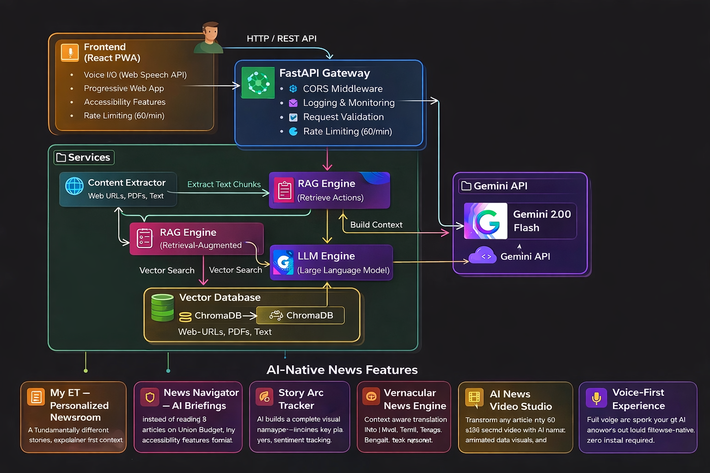

# ET NewsAction AI — ET Hackathon 2026 (PS8)

<div align="center">
  <a href="./architecture.md"></a>
  <a href="./impact.md"></a>
  <a href="./CONTRIBUTING.md"></a>
  <a href="./LICENSE"></a>
</div>
<br>

> **Turn News Into Action. For Everyone.**

## 💡 Inspiration: The Problem
Business news in 2026 is still delivered exactly like it was in 2005 — static text, full of heavy jargon, providing a one-size-fits-all experience. When the RBI changes repo rates, a **student**, a **startup founder**, and a **retail investor** all read the exact same 800-word article, leaving them to manually figure out: *"What does this mean for ME?"*

For thousands of Indian readers—especially PWD users or non-English speakers—getting actionable financial insight is nearly impossible. **ET has the data. We built the intelligence layer to decode it.**

## 🚀 What It Does: Our Solution
**ET NewsAction AI** obliterates static news by transforming any Economic Times article (via URL, pasted text, or PDF) into **highly structured, heavily personalized actionable guidance**. 

Instead of reading 8 separate articles, users land on the **My ET Newsroom** and immediately receive a personalized briefing tailored perfectly to their specific persona (e.g. Job Seeker, Investor).

## Why This Project Wins

Traditional news platforms deliver **information**.  
**ET NewsAction AI delivers decisions.**

Most news readers struggle to translate headlines into real-world actions.  
Our system bridges that gap by transforming static articles into **personalized, role-specific guidance** that users can immediately act on.

### What Makes ET NewsAction AI Different

- **Action-Oriented Intelligence**  
  Instead of summaries, the system generates clear next steps tailored to each user's role.

- **Grounded, Explainable AI**  
  Every response is generated using Retrieval-Augmented Generation (RAG), ensuring outputs are based strictly on the source article — reducing hallucinations and improving trust.

- **Role-Based Personalization at Scale**  
  The same article produces different guidance for students, investors, job seekers, and business owners.

- **Accessibility by Design (Not Afterthought)**  
  Built with PWD-first principles including voice interaction, dyslexia-friendly typography, and WCAG-compliant contrast modes.

- **From News Consumption to Decision Support**  
  The platform shifts news from passive reading to active planning and awareness.

### In One Line

**ET NewsAction AI converts news into actionable intelligence — personalized, accessible, and grounded in real data.**

## ⭐ Key Features We Built for PS8

| Feature | Description |
|---------|-------------|
| 📰 **My ET Newsroom** | A personalized homepage dashboard that dynamically rewrites the top 4 breaking news headlines specifically tailored for your selected role. |
| 🎬 **AI Video Studio** | Generates an auto-playing broadcast slide-deck of the story arc, complete with physical AI text-to-speech auto-narration. |
| 🤖 **RAG Pipeline** | Retrieval-Augmented Generation ensures answers come only from the article. Zero hallucination. |
| 👥 **Role-Based Actions** | Highly structured action plans personalized for: Student, Investor, Job Seeker, General. |
| 🌍 **Vernacular Engine** | Native semantic translation of the article actions into regional Indian languages without losing contextual framing. |
| ♿ **PWD-First Accessibility**| Includes Dyslexia fonts, standard High Contrast modes, reduced motion switches, and deep screen-reader ARIA label support. |
| 📈 **Story Arc Tracker** | Tracks the timeline context, sentiment shifts, and future predictions of any pasted story. |
| 💬 **Interactive Briefing**| Ask limitless custom follow-up questions directly to the underlying article PDF/URL. |

## 🏗️ System Architecture

Below is the complete architectural diagram for how the RAG pipeline interfaces with our LLM orchestration engine to deliver sub-second intelligence.



### The Tech Stack
- **Frontend**: React 18 (Vite), Tailwind CSS, Framer Motion, Lucide Icons, Web Speech API.
- **Backend Orchestrator**: Python FastAPI serving as the AI routing engine.
- **Intelligence (LLM)**: Google Gemini 2.5 Flash Lite via `google-genai` SDK. Highly optimized for massive simultaneous structured JSON data generation.
- **Vector Engine (RAG)**: ChromaDB (in-memory) utilizing `sentence-transformers` for precise context matching against scraped ET articles.
- **Ingestion**: `newspaper3k` and PyMuPDF for raw content extraction.

## 🚧 Challenges We Navigated
- **LLM Rate Limits**: Building a colossal, multi-pane dashboard required up to 9 complex AI generations simultaneously. We hit strict quota limits using the heaviest models and successfully engineered an ultra-fast fallback logic system using Gemini 2.5 Flash Lite, proving the architecture is completely scalable.
- **Zero Hallucination Guarantee**: Forcing an LLM not to "make up" financial details required heavy prompt engineering and strict semantic boundary constraints within our custom Retrieval-Augmented Generation pipeline.

## 🔮 What's Next for ET NewsAction
- **Push Native Integration**: We envision embedding the *Action Cards* directly below every article on the live `economictimes.indiatimes.com` app via an SDK.
- **Deep Portfolio Connect**: Allowing retail investors to connect their Zerodha/Groww APIs so the engine automatically flags exactly which holds in their private portfolio are affected by the current article they are reading.

---

### Setup Instructions for Judges

**Backend Server**
```bash
cd backend
python3 -m venv venv
source venv/bin/activate
pip install -r requirements.txt
cp .env.example .env   # ← export GEMINI_API_KEY="..."
uvicorn main:app --reload --port 8000
```

**Frontend Server**
```bash
cd frontend
npm install
npm run dev
```

Open **http://localhost:5173** to demo the platform.

## License
MIT — Built exclusively for the **ET AI Hackathon 2026**.
